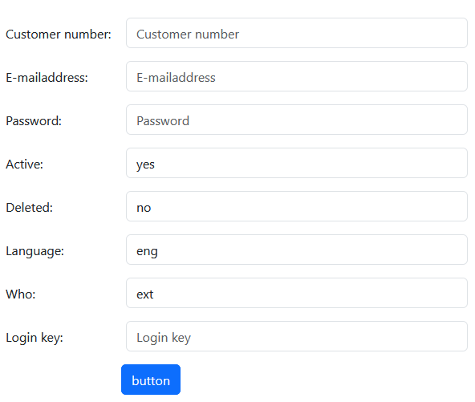
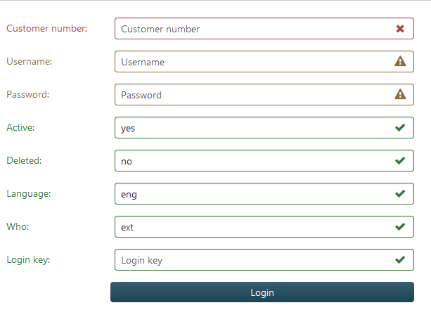

Kooijman Incorporate B.V. Suzie
===============================

Setup
=====
Although the forms are based on bootstrap 5 the validation handling uses bootstrap 3 css, place this in your css file
```css
/* form validation */
.has-feedback {position: relative;}
.has-feedback .form-control {padding-right: 42.5px;}
.form-control-feedback {margin-right: 15px;margin-top: 2px;position: absolute;top: 0;right: 0;z-index: 2;display: block;width: 34px;height: 34px;line-height: 34px;text-align: center;pointer-events: none;}
.input-lg + .form-control-feedback,
.input-group-lg + .form-control-feedback,
.form-group-lg .form-control + .form-control-feedback {width: 46px;height: 46px;line-height: 46px;}
.input-sm + .form-control-feedback,
.input-group-sm + .form-control-feedback,
.form-group-sm .form-control + .form-control-feedback {width: 30px;height: 30px;line-height: 30px;}
.has-success .help-block,
.has-success .form-label,
.has-success .col-form-label,
.has-success .radio,
.has-success .checkbox,
.has-success .radio-inline,
.has-success .checkbox-inline,
.has-success.radio label,
.has-success.checkbox label,
.has-success.radio-inline label,
.has-success.checkbox-inline label {color: #3c763d;}
.has-success .form-control {border-color: #3c763d;-webkit-box-shadow: inset 0 1px 1px rgba(0, 0, 0, 0.075);box-shadow: inset 0 1px 1px rgba(0, 0, 0, 0.075);}
.has-success .form-control:focus {border-color: #2b542c;box-shadow: 0 0 0 0.25rem rgba(103, 177, 104, 0.5);-webkit-box-shadow: 0 0 0 0.25rem rgba(103, 177, 104, 0.5);}
.has-success .input-group-addon {color: #3c763d;background-color: #dff0d8;border-color: #3c763d;}
.has-success .form-control-feedback {color: #3c763d;}
.has-warning .help-block,
.has-warning .form-label,
.has-warning .col-form-label,
.has-warning .radio,
.has-warning .checkbox,
.has-warning .radio-inline,
.has-warning .checkbox-inline,
.has-warning.radio label,
.has-warning.checkbox label,
.has-warning.radio-inline label,
.has-warning.checkbox-inline label {color: #8a6d3b;}
.has-warning .form-control {border-color: #8a6d3b;-webkit-box-shadow: inset 0 1px 1px rgba(0, 0, 0, 0.075);box-shadow: inset 0 1px 1px rgba(0, 0, 0, 0.075);}
.has-warning .form-control:focus {border-color: #66512c;box-shadow: 0 0 0 0.25rem rgba(192, 161, 107, 0.5);-webkit-box-shadow: 0 0 0 0.25rem rgba(192, 161, 107, 0.5);}
.has-warning .input-group-addon {color: #8a6d3b;background-color: #fcf8e3;border-color: #8a6d3b;}
.has-warning .form-control-feedback {color: #8a6d3b;}
.has-error .help-block,
.has-error .form-label,
.has-error .col-form-label,
.has-error .radio,
.has-error .checkbox,
.has-error .radio-inline,
.has-error .checkbox-inline,
.has-error.radio label,
.has-error.checkbox label,
.has-error.radio-inline label,
.has-error.checkbox-inline label {color: #a94442;}
.has-error .form-control {border-color: #a94442;-webkit-box-shadow: inset 0 1px 1px rgba(0, 0, 0, 0.075);box-shadow: inset 0 1px 1px rgba(0, 0, 0, 0.075);}
.has-error .form-control:focus {border-color: #843534;box-shadow: 0 0 0 0.25rem rgba(206, 132, 131, 0.5);-webkit-box-shadow: 0 0 0 0.25rem rgba(206, 132, 131, 0.5);}
.has-error .input-group-addon {color: #a94442;background-color: #f2dede;border-color: #a94442;}
.has-error .form-control-feedback {color: #a94442;}
.has-feedback label ~ .form-control-feedback {top: 31px;}
.has-feedback label.form-label ~ input.form-control-sm ~ .form-control-feedback {top: 35px;}
.has-feedback label.col-form-label ~ input.form-control-sm ~ .form-control-feedback {top: 35px;}
.has-feedback label.visually-hidden ~ .form-control-feedback {top: 0;}
.has-feedback label.visually-hidden ~ input.form-control-sm ~ .form-control-feedback {margin-top: -2px;}
.has-feedback label.col-form-label ~ input.form-control-sm ~ .form-control-feedback {margin-top: -2px;}
.row.has-feedback input.form-control-sm ~ .form-control-feedback {margin-top: -2px;}
```

Quick start
===========
- in the terminal for subsite backoffice
- database is backoffice
- table is login
```shell
$ php bin/console make:suzie Backoffice/Login database table
```
This creates the model directory
- in your controller
```php
    /**
     * @param Login $login
     * @return Response
     */
    #[Route('/security/login', name: 'backoffice_security_login')]
    public function login(App\Model\Suzie\Backoffice\Login $login): Response
    {
        $data = [
            'form' => $login->formBuilder->completeForm
        ];

        return $this->render("hereweconnect/login.html.twig", $data);
    }
```
Inject the suzie model and you can call the standard form completely build for you

- changing the form and inputs
````php
        $login->formBuilder->form->labelColWidth(0)->elementSize('sm');
        $login->formBuilder->formElements->email->displayName('username')->elementType('text');
        $login->formBuilder->formElements->button->displayName('login')->addClass(' btn-main w-p-100')->name('login')->lockedValue('login');
        $login->formBuilder->setElements()->setCompleteForm();
````
1. change the column width to 0 for label above the input and set all inputs to sm
2. change display name of email to username and the element type to text from email
3. change button style, name and value
4. rebuild the elements and the complete form
5. hit the button and the form is automatically checked with basic settings

